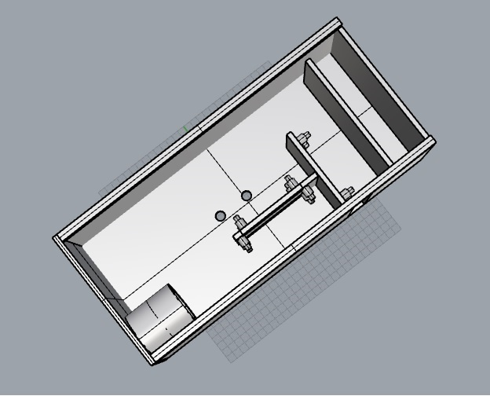
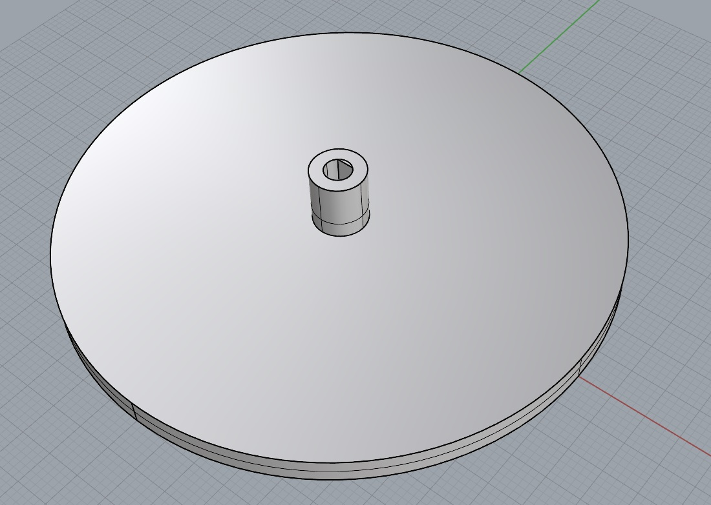
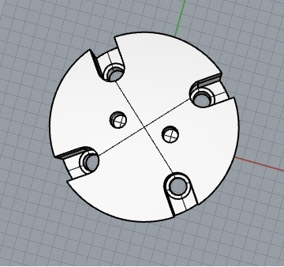
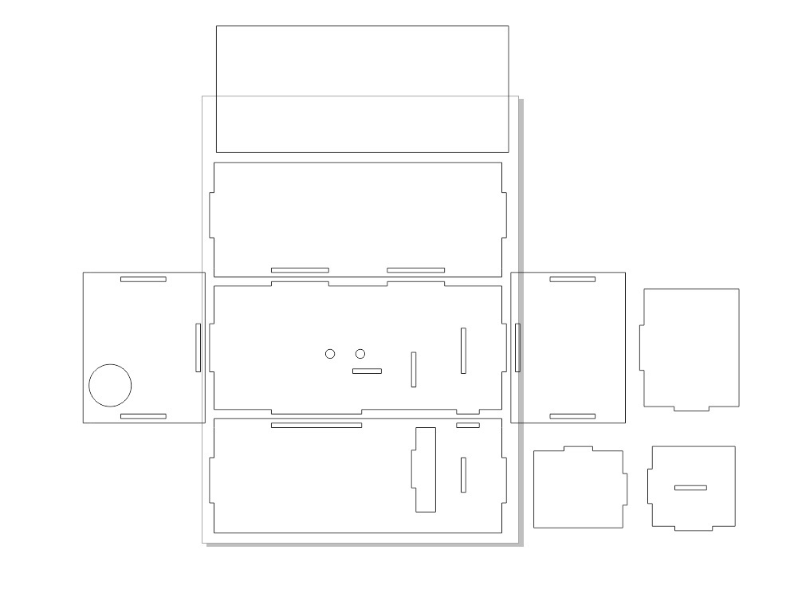
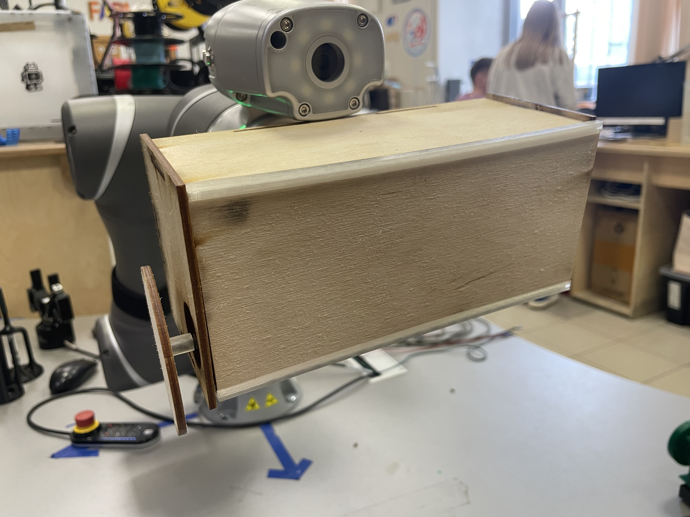
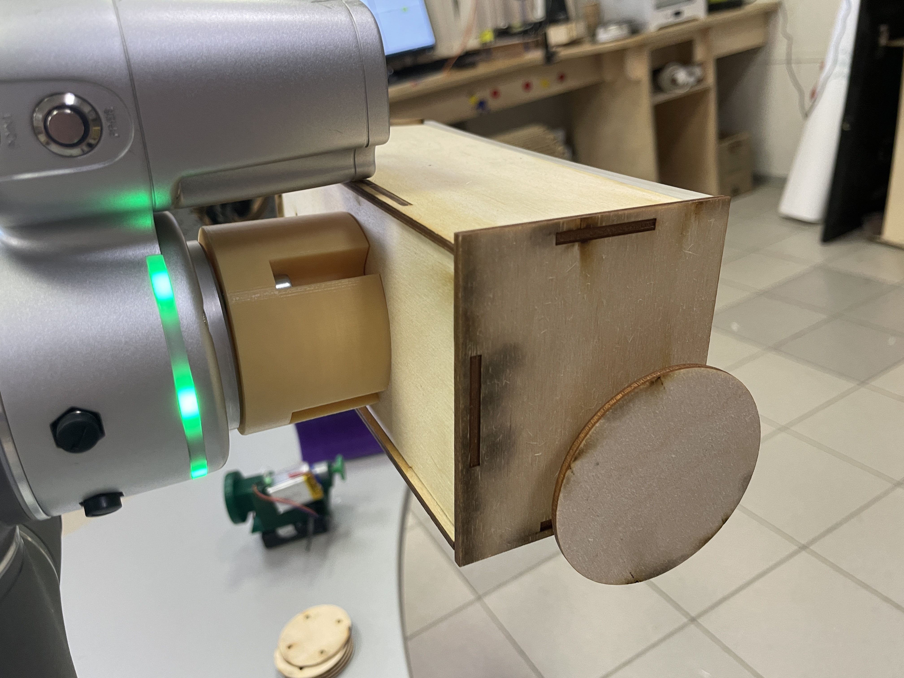
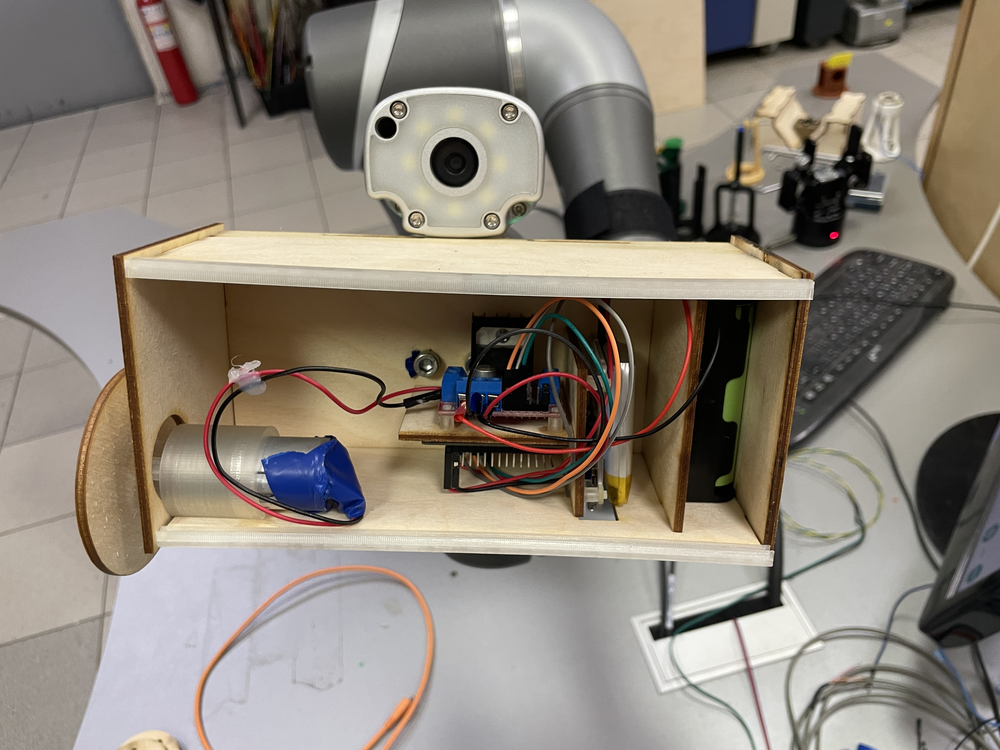
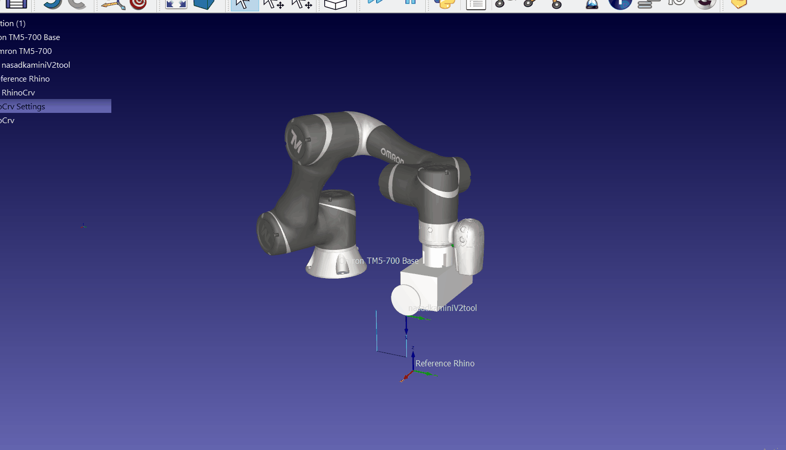

# projectX
## Для создания использовалось
1. плата esp32
2. драйвер L298n
3. dc мотор
4. 3D принтер
5. лазерный гравер

## Идея
Создане прототипа насадки манипулятора Omron tm5-700 для распила досок. Но так же можно использовать и для других целей.

## Создание
Для управления мотором были использованы драйвер L298n и плата esp32 на которой был развёрнут web сервер дистанционного управления мотором.
Код управления:
```C++
#include <WiFi.h>
#include <AsyncTCP.h>
#include <ESPAsyncWebServer.h>
#include <L298N.h>

const char* ssid = "OSobaMask";
const char* password = "123056789";

int ENA = 12;
int IN1 = 14;
int IN2 = 27;
String slider_value = "0";

const int frequency = 500;
const int pwm_channel = 0;
const int resolution = 8;


const char* input_parameter = "value";

AsyncWebServer server(80);

const char index_html[] PROGMEM = R"rawliteral(
<!DOCTYPE HTML><html>
<head>
  <meta name="viewport" content="width=device-width, initial-scale=1">
  <style>
    html {font-family: Times New Roman; display: inline-block; text-align: center;}
    h2 {font-size: 2.3rem;}
    p {font-size: 2.0rem;}
    body {max-width: 400px; margin:0px auto; padding-bottom: 25px;}
    .slider { -webkit-appearance: none; margin: 14px; width: 360px; height: 25px; background: #4000ff;
      outline: none; -webkit-transition: .2s; transition: opacity .2s;}
    .slider::-webkit-slider-thumb {-webkit-appearance: none; appearance: none; width: 35px; height: 35px; background:#01070a; cursor: pointer;}
    .slider::-moz-range-thumb { width: 35px; height: 35px; background: #01070a; cursor: pointer; } 
  </style>
</head>
<body>
  <p><span id="textslider_value">%SLIDERVALUE%</span></p>
  <p><input type="range" onchange="updateSliderPWM(this)" id="pwmSlider" min="0" max="255" value="%SLIDERVALUE%" step="1" class="slider"></p>
<script>
function updateSliderPWM(element) {
  var slider_value = document.getElementById("pwmSlider").value;
  document.getElementById("textslider_value").innerHTML = slider_value;
  console.log(slider_value);
  var xhr = new XMLHttpRequest();
  xhr.open("GET", "/slider?value="+slider_value, true);
  xhr.send();
}
</script>
</body>
</html>
)rawliteral";

String processor(const String& var){
  if (var == "SLIDERVALUE"){
    return slider_value;
  }
  return String();
}

void setup(){
  Serial.begin(115200);
  delay(1000);
  pinMode(ENA, OUTPUT);
  pinMode(IN1, OUTPUT);
  pinMode(IN2, OUTPUT);

  ledcSetup(pwm_channel, frequency, resolution);
  ledcAttachPin(ENA, pwm_channel);
  ledcWrite(pwm_channel, slider_value.toInt());
  digitalWrite(IN1, LOW);
  digitalWrite(IN2, LOW);

  WiFi.begin(ssid, password);
  while (WiFi.status() != WL_CONNECTED) {
    delay(1000);
    Serial.println("Connecting...");
  }

  Serial.println(WiFi.localIP());

  server.on("/", HTTP_GET, [](AsyncWebServerRequest *request){
    request->send_P(200, "text/html", index_html, processor);
  });

  server.on("/slider", HTTP_GET, [] (AsyncWebServerRequest *request) {
    String message;
    if (request->hasParam(input_parameter)) {
      message = request->getParam(input_parameter)->value();
      slider_value = message;
      ledcWrite(pwm_channel, slider_value.toInt());
        digitalWrite(IN1, HIGH);
        digitalWrite(IN2, LOW);
    }
    else {
      message = "No message sent";
    }
    Serial.println(message);
    request->send(200, "text/plain", "OK");
  });
  
  server.begin();
}
  
void loop() {
  
}
```
Так выглядит web страница на телефоне:\
\
Затем были сделаны корпус в котором будет распологаться электроника и иммитация пильного диска который крепится к мотору.\
Корпус:\
\
Круг:\
\
Крепление насадки:\
\
Корпус под вырезку из фанеры:\



## Результат
Насадка в живую на манипуляторе:
\
Крепление к манипулятору:
\
Насадка изнутри:
\
GIF симуляция работы манипулятора:
\
Видео работы насадки и манипулятора:

